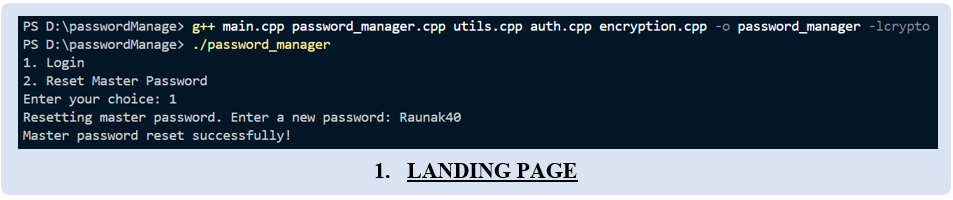
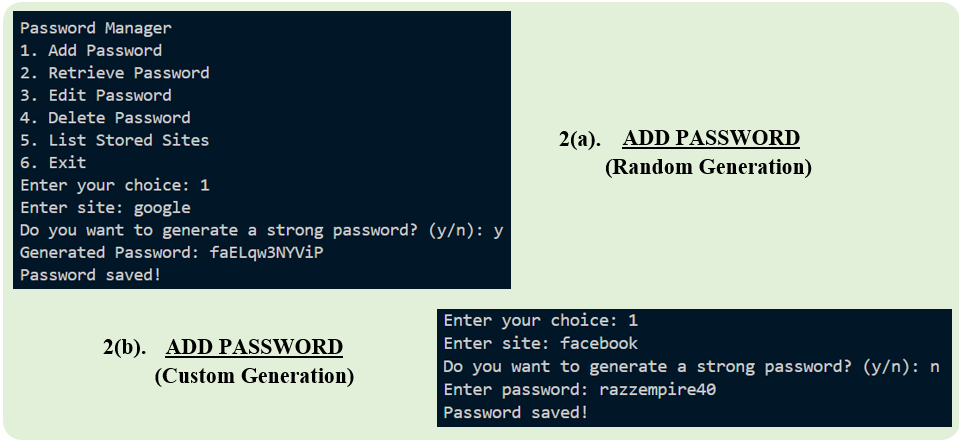
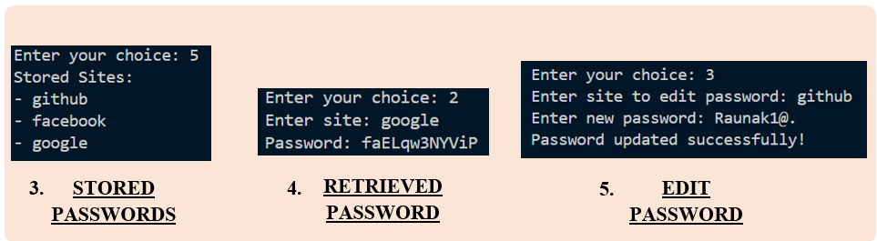
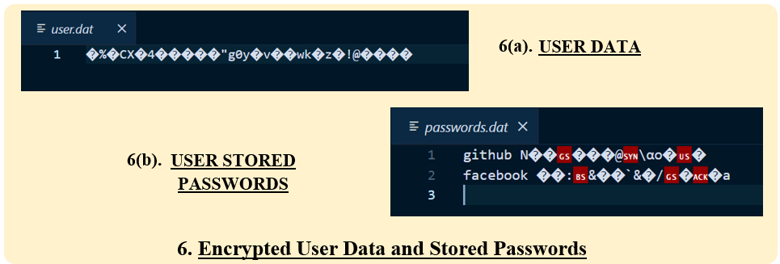

# **Password Manager Security Using AES-256 Encryption**  

## **Overview**  
This project presents a **secure password manager** developed using **C++**, incorporating **AES-256-CBC encryption** for enhanced security. The system ensures that stored credentials remain private and protected from unauthorized access.  

## **Features**  
- **AES-256-CBC Encryption**: Ensures strong encryption for password storage.  
- **Master Password Authentication**: Secure access to stored credentials using SHA-256 hashing.  
- **Command-Line Interface (CLI)**: User-friendly interface for managing passwords.  
- **Password Management**: Add, retrieve, edit, and delete stored credentials securely.  
- **Random Password Generator**: Creates strong passwords to improve security.  
- **Local Storage**: Eliminates dependency on cloud-based password managers.  

## **Implementation**  
The project consists of several **C++ modules**:  
- **Authentication Module (`auth.cpp`)**: Handles user verification and master password setup.  
- **Encryption Module (`encryption.cpp`)**: Implements AES-256-CBC encryption using OpenSSL.  
- **Utilities Module (`utils.cpp`)**: Provides password hashing and random password generation.  
- **Main Application (`main.cpp`)**: Integrates all modules into a CLI-based password manager.  

## **Requirements**  
- **C++ Compiler** (GCC, Clang, MSVC, etc.)  
- **OpenSSL Library** (for AES encryption)

## **Output**
- **Landing Page**
  
- **Add Password**
  
- **Functionalities**
  
- **Encrypted User Data**
  

## **Limitations**  
- **No Multi-Factor Authentication (MFA)**  
- **Lacks cross-platform integration** (only CLI-based)  
- **No password health analysis or breach detection**  
- **Limited encryption algorithm support**  

## **Future Enhancements**  
- **Biometric/TOTP authentication** for added security  
- **Cross-platform compatibility** (desktop & mobile synchronization)  
- **Support for additional encryption algorithms**  
- **Secure file storage for documents**  
- **Password sharing with authorized users**  

## **How to Use**  
1. **Compile the Code** using a C++ compiler with OpenSSL support.  
2. **Run the Application** and set up a master password.  
3. **Use the CLI Menu** to store, retrieve, edit, or delete credentials securely.  

## Contributors ✨

Thanks to these amazing contributors:

- [@AkshitSadotra](https://github.com/akshit-123-lab)
- [@JoyntiMahato](https://github.com/Joynti)
- [@PriyaMahato](https://github.com/SOhniYo)
- [@RaunakRaj](https://github.com/Raunak40)

